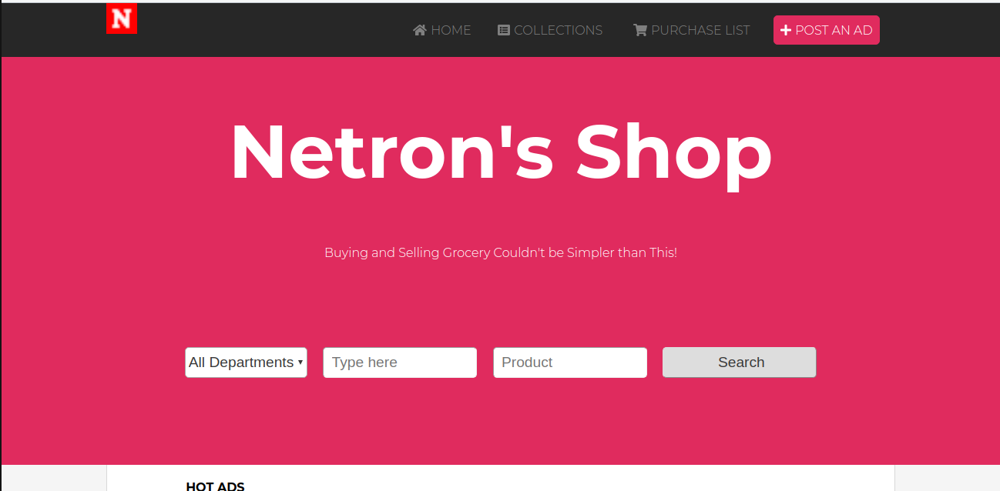

# Project - Capstone-Project

# What it does

This project is the Capstone Project of the Main HTML/CSS curriculum at [Microverse](https://www.microverse.org/). It consists of building an online shop,
read more about the project detailed description [here](https://www.notion.so/HTML-CSS-capstone-project-Online-shop-for-electronics-a3dbffab0c744c33b70001a79876edde).

## Project Objectives

- The main page (search page), with a link to the results page
- the search results page
- mobile: up to 768px
- tablet & desktop: from 768px

## Built With

- HTML5
- CSS3
- font-awesome
- google fonts

## Live Demo

[Live Link](https://rawcdn.githack.com/Joecleverman/capstorne-project/eef9643409548e87bd75ac805e45f79fda9a13e0/index.html)

## Project Presentation

[Watch video](https://www.loom.com/share/c4dd36b60aa7401d84142641ce696413)

## 🤝 Contributing

Contributions, issues and feature requests are welcome! Start by:

- Forking the project
- Cloning the project to your local machine
- `cd` into the project directory
- Run `git checkout -b your-branch-name`
- Make your contributions
- Push your branch up to your forked repository
- Open a Pull Request with a detailed description to the development branch of the original project for a review

## Author

👤 **Josue Abraham**

- Github: [joecleverman](https://github.com/joecleverman)

## Show your support

Give a ⭐️ if you like this project!

## 📝 License

Free

### Enjoy!
